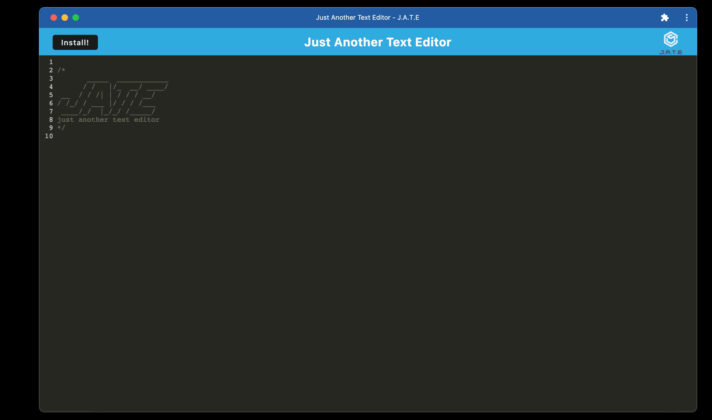

# Just Another Text Editor

## Description

[](https://opensource.org/licenses/BSD)


The motivation of this project was create a text editor that can be available with or without internet connection.

This project solves the issue of being unable to create or retrieve notes reliably due to internet connection.


## Table of Contents
- [Installation](#installation)
- [Usage](#usage)
- [License](#license)
- [Contributing](#contributing)
- [Questions](#questions)

<a name="installation"></a>
## Installation 

This project requires the following: VSCode, Node.js

The following code will be necessary to utilize this project:

``` npm i and npm start ```

<a name="usage"></a>
## Usage 
Link to deployed application: [Just Another Text Editor](link)

Go to link to deploy application. Click the Install button for offline use. 

App online:


App offline:


<a name="license"></a>
## License 
BSD

  
  <a name="contributing"></a>
  ## Contributing
  
  Created by [Katelyn King](https://github.com/katelynking)
  
 

  <a name="questions"></a>
  ## Questions
  
  GitHub username: [katelynking](https://github.com/katelynking)
  
  Email: katelynking112@gmail.com
  
  Please feel free to contact me with any questions.
